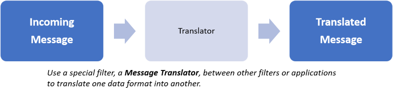
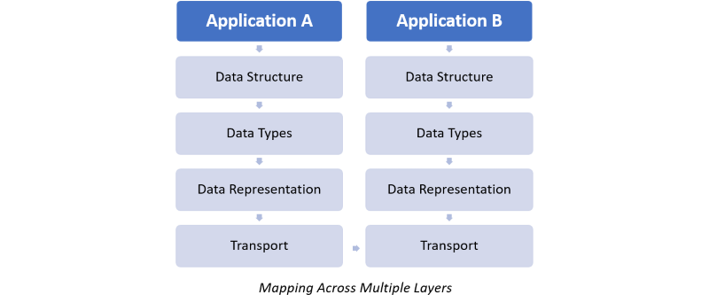

# Message Translator Pattern

Translate data from one format to another.

This pattern was originally [described][message-translator-pattern] in the book *Enterprise Integration Patterns*, by Gregor Hohpe and Bobby Woolf.

## Context and problem

Applications are often built around proprietary data models. Messages are routed between existing applications, such as legacy systems, off-the-shelf systems, custom applications, or applications offered by third-parties. For example, each application might have a slightly different concept of a Customer entity, the attributes that defined a Customer, and other entities related to the Customer. The accounting system might required the Taxpayer ID, while customer-relationship managment (CRM) system might need access to phone numbers and addresses. With the differences in application, each application typically expects to receives messages that is in alignment with the it's internal data format.

In addition to internal data models and formats, messages are often exchanged with external business partners via standardized formats, for example, EDI X12, EDIFACT and other industry standard formats. Messages need to be sent in "official" data formats, even though the internal data formats are based on propreitary formats.

Message transformation could be completely avoided if all applications used a common data format, but in practice, this is difficult to achieve. Changing and application's data format is risky and requires changes that impacts business functionality.

Sometimes the physical representation of the data needs to be changed. One application may use JSON documents, whereas the other application uses XML documents.

The data format for two applications could be formatted to be the same, but this ends up tying the applications closer to each other, which runs contrary to key architectural principals such as loose coupling between applications. This creates a dependency between the two applications where application changes or replacement will affect the other application.

## Solution

Messages can be translated from one form to another using an intermediatory, or translator. For example, data elements may share the same name and data types but may be used in different physical formats, such as JSON or CSV. Or, the physical formats may be shared between applications, but names might be different.

Message translations may occur at different levels:

|Layer |Areas |Transformations |Tools/Techniques
--- | --- | --- | ---
|Data Structure|Entities, associations and cardinality|Flatten many-to-many relationships|Structual mapping patterns, custom code
|Data Types|Cross-references, domains, constraints, data types, field names|Concatenate First Name and Last Name into Name, convert Postal Code from numeric to string|XSL, database lookups, customer code|
|Data Representation|Data formats (XML, JSON), character sets (ASCII), encryption/compression|Parse data and render in a different format, decrypt/encrypt|XML, parsers, custom code
|Transport|Communcation protocols (HTTP, REST)|Move data between protocols without affecting the message|[Channel Adapter][channel-adapter-pattern] messaging pattern

The _Transport_ layer provides data transfer between systems. It is responsible for complete and reliable data transfer from one system to another.

The _Data Representation_ layer, also know as the _syntax_ layer, defines how the data will be represented when transported. The transport layer usually sends data in a character or by stream format, meaning that complex data is converted into a character string. In many cases the data needs to be encrypted, decrypted, compressed or uncompressed.

The _Data Type_ layer defines the application data types for application, or domain models. This is where determinations are made on how the data should be represented. Postal codes are converted from numbers to strings, First Name and Last Name are concatenated into a single field called Name. Multiple values stored as a string are converted to string array.

The _Data Structures_ layer, also called the _application_ layer describes the data according to the application's domain model. The layer defines the logical entities that the application works with, such as _Customer_, _Address_ or _Purchase Order_, as well as the relationship between entities. A customer can have multiple addresses and invoices. An invoice includes the customer and address.

## Issues and considerations

Many design trade-offs in integration are driven by the need to follow architectural design best practices which stresses that components and applications are decoupled from another. Integrations that connect applications together have to account for changes to these applications. The _Message Translator_ pattern can remove these additional levels of dependencies.  

Many business processes require transformations at more than one layer. For example, a partner sends a  _Purchase Order_ file, in XML format, has to be translated to JSON format, Postal Codes have to be converted to strings, First Name and Last have to be concatenated and then sent over HTTP to the order management system.

With a layered model, each layer can be treated individually with no concern about the lower layers.

Multiple _Message Translators_ can be chained together using [Pipes and Filters][pipes-filter-pattern]. 

Chaining multiple Message Translators allows for changes in transformations used by individual layers without affecting other layers.

## When to use this pattern

This pattern should be used for translating messages between applications. Using this pattern ensures compatibility between applications that support different data types, keeping them independent of one another.

## Examples

## Related patterns and guidance

The are many variations of the _Message Translator_ pattern:

* The [_Envelope Wrapper_][envelope-wrapper-pattern] wraps the data with an envelope so it can be transported across the messaging system.
* The [_Content Enricher_][envelope-wrapper-pattern], or _Data Enricher_ adds information to a message.
* The [_Content Filter_][envelope-wrapper-pattern] removes information from a message.
* The [_Claim Check_][claim-check-pattern] removes information and stores it for later retrieval.
* The [_Normalizer_][envelope-wrapper-pattern] can convert a number of different message formats into a consistent format.

Inside each of these patterns, complex structural transformations can occur.

<!-- links -->
[message-translator-pattern]: https://www.enterpriseintegrationpatterns.com/patterns/messaging/MessageTranslator.html
[sample-code]: https://github.com/mspnp/cloud-design-patterns/tree/master/message-translator
[channel-adapter-pattern]: https://www.enterpriseintegrationpatterns.com/patterns/messaging/ChannelAdapter.html
[claim-check-pattern]: https://docs.microsoft.com/en-us/azure/architecture/patterns/claim-check
[pipes-filter-pattern]: https://docs.microsoft.com/en-us/azure/architecture/patterns/pipes-and-filters
[envelope-wrapper-pattern]: https://www.enterpriseintegrationpatterns.com/patterns/messaging/EnvelopeWrapper.html
[content-enricher-pattern]: https://www.enterpriseintegrationpatterns.com/patterns/messaging/DataEnricher.html
[content-filter-pattern]: https://www.enterpriseintegrationpatterns.com/patterns/messaging/ContentFilter.html
[normalizer-pattern]: https://www.enterpriseintegrationpatterns.com/patterns/messaging/Normalizer.html
